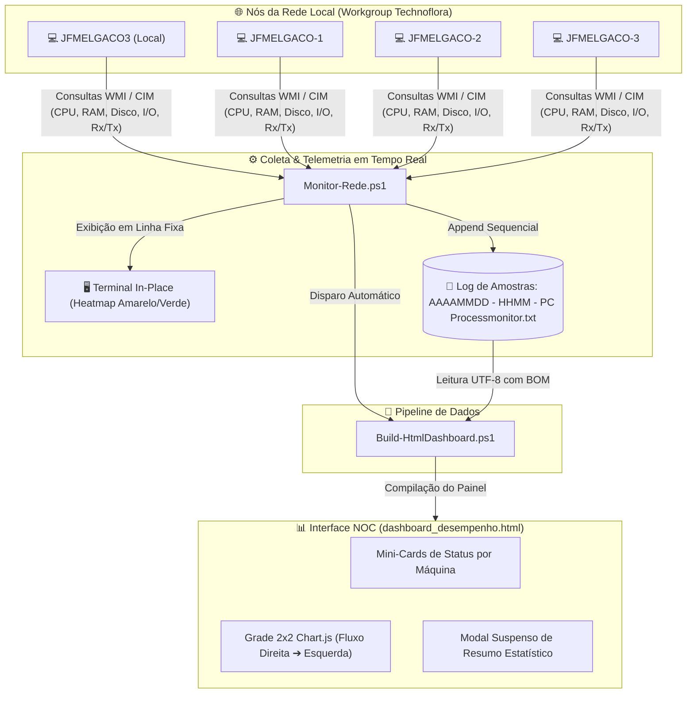

# 🖥️ PCProcessMonitor

> **Sistema leve e autônomo de monitoramento de infraestrutura local em tempo real, com telemetria via PowerShell/WMI e Dashboard visual estilo NOC (Network Operations Center).**


---

## 🎯 Visão Geral

O **PCProcessMonitor** foi desenvolvido para monitorar a saúde operacional (CPU, Memória RAM, Armazenamento em Disco e Tráfego de Rede) de múltiplas máquinas em uma rede local (Workgroup), sem a necessidade de instalar agentes pesados, servidores web dedicados ou bancos de dados complexos.

O ecossistema é composto por dois scripts PowerShell e uma interface web moderna de alta densidade de informação:
1. **`Monitor-Rede.ps1`**: Coletor contínuo de métricas via WMI/CIM com saída em terminal dinâmico (*in-place*) e persistência em logs.
2. **`Build-HtmlDashboard.ps1`**: Gerador analítico que processa os logs brutos e constrói o painel HTML interativo.
3. **`dashboard_desempenho.html`**: Dashboard em tela única (`100vh`) com fluxo temporal contínuo da direita para a esquerda (estilo Gerenciador de Tarefas do Windows).

---

## ⚡ Principais Características Técnicas

### 1. Coletor em Tempo Real (`Monitor-Rede.ps1`)
- **Topologia Canônica e Detecção Automática do Host Local:** Lista unificada das 4 máquinas (`JFMELGACO3`, `JFMELGACO-1`, `JFMELGACO-2` e `JFMELGACO-3`). O script detecta automaticamente em qual máquina está rodando (`$env:COMPUTERNAME`), marcando-a como `(Local)` e consultando as demais remotamente, garantindo que o painel funcione de forma idêntica em qualquer notebook.
- **Detecção Rápida de Máquinas Offline:** Realiza um teste de conectividade ultrarrápido (ping) prévio antes das consultas CIM/WMI, evitando travamentos e esperas de timeout caso um notebook esteja desligado.
- **Terminal In-Place sem Flickering:** Em vez de usar `Clear-Host` (que causa cintilação na tela), utiliza o reposicionamento do cursor (`[Console]::SetCursorPosition(0,0)`), garantindo uma atualização suave e contínua no prompt.
- **Heatmap de Cores no Console:**
  - 🟡 **Amarelo:** Valores numéricos que aumentaram em relação ao ciclo anterior (maior consumo).
  - 🟢 **Verde:** Valores numéricos que diminuíram (alívio de consumo).
  - ⚪ **Branco:** Valores estáveis ou medição de referência inicial.
- **Telemetria de Disco C: (Espaço e Taxa de I/O):**
  - Espaço livre em GB e porcentagem de ocupação do disco.
  - Taxas em tempo real de **Input (Leitura - Read)** e **Output (Escrita - Write)** em KB/s ou MB/s (`Win32_PerfFormattedData_PerfDisk_LogicalDisk`).
- **Métricas de Rede Bidirecionais:** Exibe e registra as taxas de download (**Rx**) e upload (**Tx**) em KB/s e MB/s para cada computador.
- **Rotação de Logs com Timestamp:** Cria automaticamente na inicialização arquivos organizados no formato:
  `AAAAMMDD - HHMM - PC Processmonitor.txt` (gravados na subpasta `Data/` se disponível, ou na raiz do projeto).
- **Gatilho Automático do Dashboard:** Dispara o script gerador de HTML a cada nova rodada de dados para manter o painel web sempre sincronizado.

---

### 2. Pipeline de Processamento Analítico (`Build-HtmlDashboard.ps1`)
- **Detecção Inteligente do Último Log:** Localiza dinamicamente o arquivo de telemetria mais recente da pasta (com busca recursiva na pasta `Data/`), sem necessidade de parâmetros manuais.
- **Resiliência a Codificação (UTF-8 com BOM):** Leitura via `[System.IO.File]::ReadAllLines` e exportação com codificação UTF-8 com BOM, evitando problemas de caracteres corrompidos (*mojibake*) em ambientes Windows PowerShell 5.1 (PT-BR).
- **Consolidação Estatística:** Calcula picos, médias operacionais e valores mínimos de cada nó para CPU, Memória, Disco (Espaço e I/O) e Rede.

---

### 3. Dashboard Web NOC (`dashboard_desempenho.html`)
- **Visualização em Tela Única (`100vh` sem Rolagem):** Desenvolvido para monitores de operações (NOC), mantendo 100% dos dados e gráficos visíveis na viewport sem barras de rolagem.
- **Alternador de Modos:** Botão flexível para alternar instantaneamente entre **🖥️ Modo Tela Única** e **📜 Modo Rolagem Clássico**.
- **Fluxo Contínuo Estilo Gerenciador de Tarefas (Task Manager):**
  - Os dados entram pela extremidade direita (*"Agora"*) e deslizam continuamente para a esquerda a cada novo ciclo.
  - No início da coleta (poucas amostras), a linha parte da direita e avança sobre a grade vazia à esquerda, exatamente como no Windows Task Manager.
- **Seletor de Janela Temporal com Memória:**
  - ⚡ **60 Amostras (Padrão)**
  - ⏱ **120 Amostras (~10 min)**
  - 📊 **Histórico Completo**
  - Preferência gravada automaticamente no `localStorage` do navegador.
- **Grade 2x2 Adaptativa de Gráficos (Chart.js):**
  - Gráfico de CPU (%)
  - Gráfico de Memória RAM (%)
  - Gráfico de Download Rx (KB/s)
  - Gráfico com Abas Rápidas no 4º quadrante: `Tx (Upload)`, `Disco C: (GB)` e `I/O Disco (KB/s)`!
- **Mini-Cards dos Computadores (46px):** Pílulas horizontais com status de conexão e métricas instantâneas de CPU, RAM, Disco C:, I/O e Rede.
- **Auto-Refresh Integrado:** Contador regressivo de 5 segundos no cabeçalho com botões de `⏸ Pausar` e `▶ Retomar`.
- **Modal Suspenso de Resumo Estatístico:** Botão `📋 Tabela Resumo` com exibição de tabela analítica completa contendo picos de I/O de disco (fechamento via `ESC` ou clique externo).

---

## 🏗️ Arquitetura do Sistema



---

## 📁 Estrutura de Arquivos

```text
PCProcessMonitor/
├── Monitor-Rede.ps1                    # Script principal de telemetria e console in-place
├── Build-HtmlDashboard.ps1             # Gerador analítico do dashboard HTML
├── dashboard_desempenho.html           # Interface visual aberta no navegador
├── Data/                               # Pasta de arquivamento dos logs históricos
│   └── AAAAMMDD - HHMM - PC Processmonitor.txt
├── README.md                           # Documentação técnica do projeto
└── .gitignore                          # Regras de exclusão do Git
```

---

## 🚀 Como Executar

### Pré-requisitos
- **Sistema Operacional:** Windows 10 ou Windows 11.
- **PowerShell:** Windows PowerShell 5.1 ou PowerShell 7+.
- **Rede Local:** Máquinas configuradas no mesmo grupo de trabalho (ex: `Technoflora`) com permissão de consulta WMI/CIM na rede local.

### Passo a Passo

1. **Abra o terminal do PowerShell** na pasta do projeto:
   ```powershell
   cd "C:\Users\Julian\Dev\PCProcessMonitor"
   ```

2. **Inicie o monitoramento contínuo:**
   ```powershell
   .\Monitor-Rede.ps1
   ```
   *O console passará a exibir o quadro atualizado em tempo real com destaque em amarelo para aumentos e verde para quedas.*

3. **Abra o Dashboard no seu navegador:**
   - Dê um duplo clique no arquivo `dashboard_desempenho.html` ou execute no PowerShell:
   ```powershell
   Start-Process .\dashboard_desempenho.html
   ```
   *A página se atualizará automaticamente a cada 5 segundos.*

---

## 🛠️ Tecnologias Utilizadas

- **PowerShell:** Coleta de dados via WMI (`Win32_*`), manipulação de processos e I/O de arquivos.
- **Tailwind CSS:** Estilização utilitária moderna para layout responsivo de alta densidade e modo escuro.
- **Chart.js:** Renderização de gráficos temporais em Canvas HTML5 com animações suaves.
- **HTML5 / Vanilla JavaScript:** Lógica de fluxo temporal contínuo, persistência local de preferências (`localStorage`) e auto-refresh.
